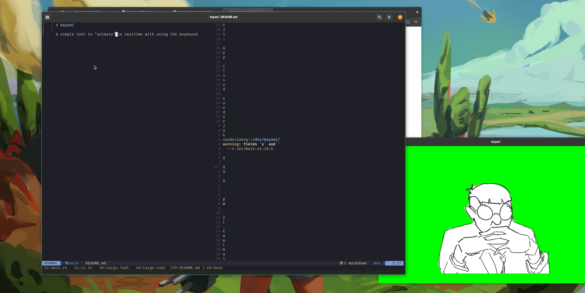

# keyani

A simple tool to "animate" in realtime with using the keyboard.

The goal is to add a bit of personality on the screen for streamers who only
type without cam/vioce. Also to learn rust ofc.

live [notes](https://catkin-stage-002.notion.site/keytuber-keyani-0f677bcda54d441eac9a96f1faa3b8f5).
